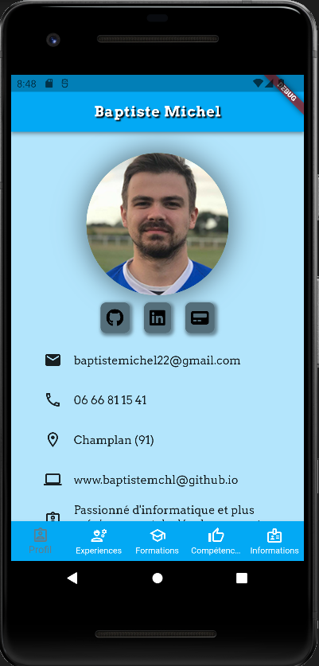
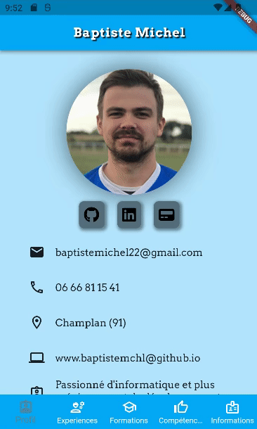
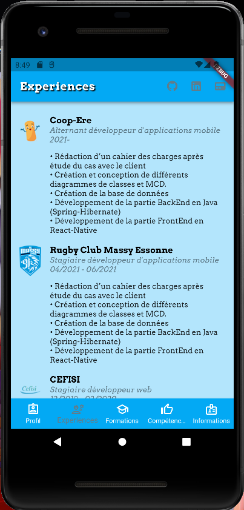
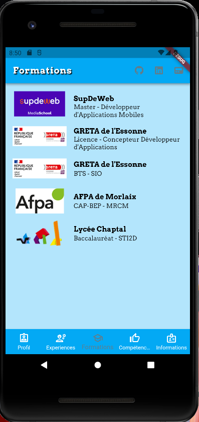
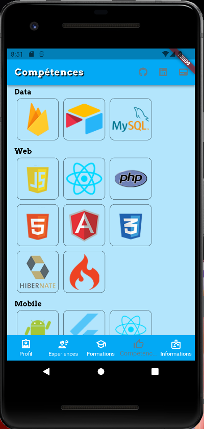
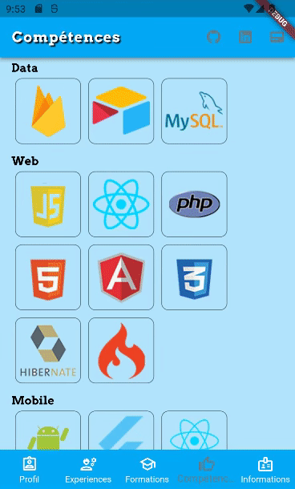
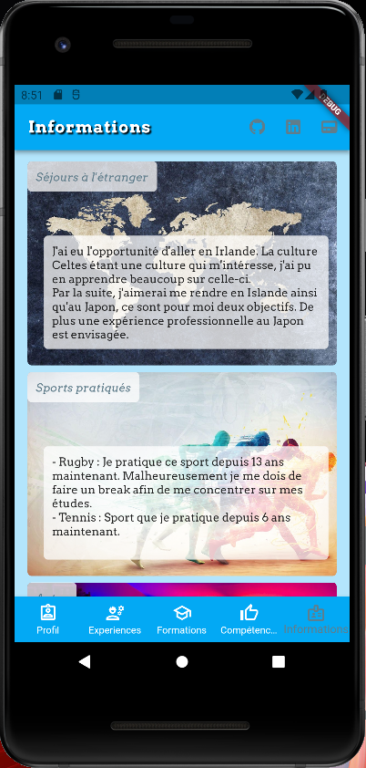

# Application CV

CV App / Cours FLUTTER :

- [Application CV](#application-cv)
  * [A propos du projet](#a-propos-du-projet)
  * [IHM Profil](#ihm-profil)
  * [IHM Experiences](#ihm-experiences)
  * [IHM Formations](#ihm-formations)
  * [IHM Compétences](#ihm-compétences)
  * [IHM Informations](#ihm-informations)

### Video de l'ensemble de l'application.

| Prévisualisation du projet  | Nota | 
| :---:      |     :---:      | 
|| Les icones comme Linkedin ou Github situés sur la page Profil   ainsi que sur l'appBar sont cliquables et   redirigent vers mes profils.

## A propos du projet 

| Commentaires sur le projet | Difficultés principales | Evolutions envisagées |
| :---:      |     :---:      |         :---: |
| Projet intéressant mais difficile   dû à un manque (pour le moment) de compétences.   En revanche je sens que j'ai vraiment pu progresser   en passant quelques journées à chercher   des solutions sur le net.    | Ma principale difficulté à été   d'afficher les images. Malgré le cours   il s'agissait de récupérer uniquement   l'URL d'une chaine JSON. Après beaucoup de temps passé   j'ai réussis à trouver une solution.    | Le projet étant intéressant, j'aimerai faire évoluer l'application  - Rendre les pages "swipables" entre elles pour une meilleure navigation  - Permettre à l'utilisateur d'appuyer sur le numéro de telephone et mail   afin d'ouvrir sur le device l'application téléphone ou gmail.  |

## IHM Profil

ProfilScreen picture             |  ProfilScreen video
:-------------------------:|:-------------------------:
  |  

## IHM Experiences

ExperiencesScreen picture             |  ExperiencesScreen video
:-------------------------:|:-------------------------:
  |  

## IHM Formations

FormationsScreen picture             |  FormationsScreen video
:-------------------------:|:-------------------------:
  | Pas de video, la page est scrollable   mais manque d'éléments pour la faire scroll

## IHM Compétences

CompétencesScreen picture             |  CompétencesScreen video
:-------------------------:|:-------------------------:
  |  

## IHM Informations

InformationsScreen picture             |  InformationsScreen video
:-------------------------:|:-------------------------:
  |  
